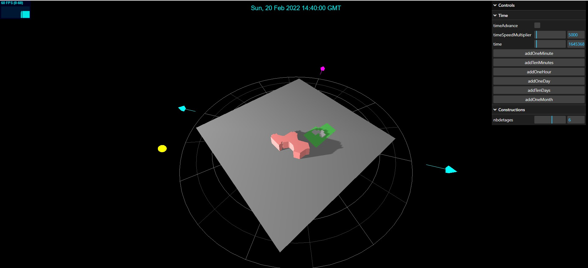
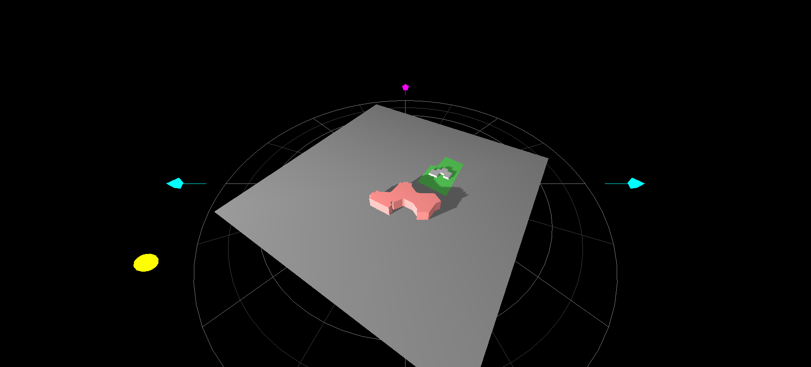

# Mesures d'ombres

Ce petit jouet aide à visualizer l'ombre sur un terrain.

Dans mon cas, une école voulait construire un énorme (6 étages) batiment juste à côté de chez nous, et je voulais évaluer l'impact de ces étages sur notre ensoleillement au long de l'année, et voir le résultat avec 4 et 5 étages à la place.

Voici les images générées pour le 20 février 2022:

4 étages:

5 étages:

6 étages

## Usage:

Voir [le readme anglais](./README.md)

## License

MIT
